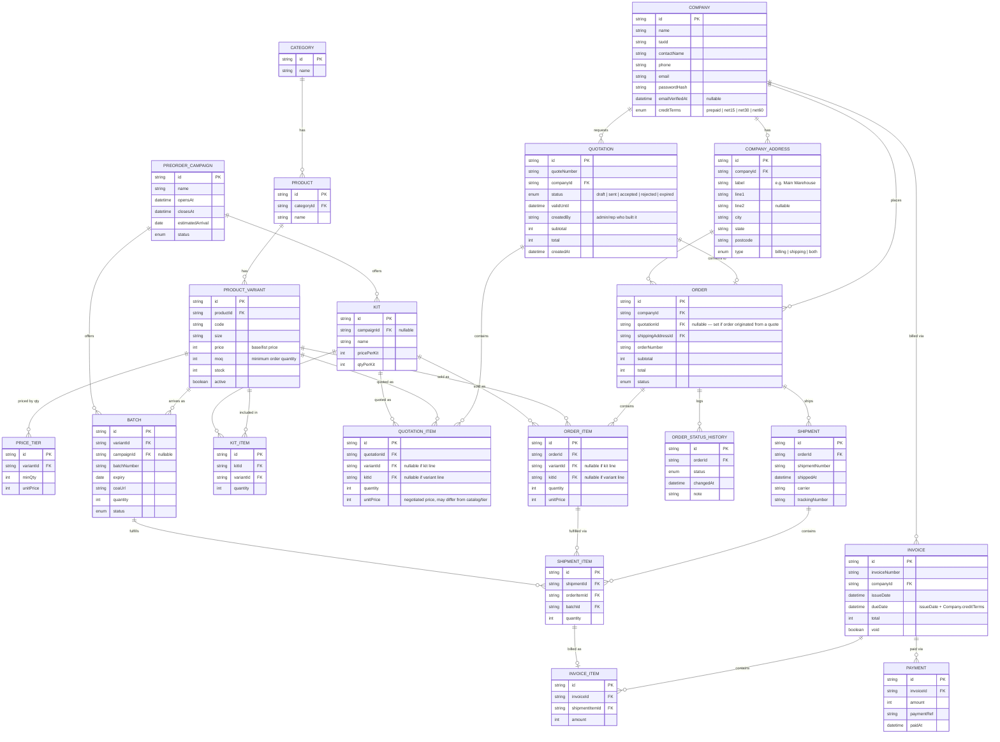

# AscendB2B — Relational Diagram (design draft, not yet migrated)

Existing catalog models (`Category`, `Product`, `ProductVariant`) are carried over from AscPeps; `Order`/`OrderItem` are carried over but reshaped. Everything else here is proposed, not yet in `schema.prisma`. Admin/support models (`AdminUser`, `Setting`, `Insight`, `EmailOutbox`, `DiscountCode`, `ProductAddOn`) are omitted — unaffected by the B2B rework.

Catalog is public — anyone can browse products, kits, and bulk price tiers without an account. Adding to cart, requesting a quote, and checking out require a signed-in `Company` (that gate is app-layer, not schema).

## Notes on the modeling choices

- **Catalog is public; transacting isn't.** No schema gate needed for browsing — `Product`/`ProductVariant`/`PriceTier`/`Kit` are readable by anyone. Cart, quote requests, and checkout are blocked behind `Company` auth at the app layer.
- **`Company` is its own login** — `passwordHash`/`emailVerifiedAt` live directly on `Company` rather than a separate user table, consistent with the earlier call to skip multi-contact logins for now (one business = one account = one row).
- **No separate "approval" status on signup.** A new `Company` can sign up and transact immediately on `creditTerms: prepaid` — admin upgrading them to `net30` etc. *is* the approval step, so there's no redundant pending/approved flag to keep in sync.
- **`PriceTier` is quantity-break pricing per variant** (`minQty` → `unitPrice`, open-ended until the next tier) — feeds the *suggested* price shown in the storefront/quote builder. `OrderItem.unitPrice`/`QuotationItem.unitPrice` still store their own snapshot, so a negotiated quote can always override the tier price.
- **`ProductVariant.moq`** enforces a purchase floor independent of pricing — stops a bulk-only SKU being ordered as a single unit through the storefront.
- **`CompanyAddress` replaces typed-per-order addresses** — `Order.shippingAddressId` points at one of the company's saved addresses instead of duplicating address fields onto every order like the old B2C checkout did.
- **`batchId` moved off `OrderItem` onto `ShipmentItem`.** Batch assignment is a *fulfillment-time* decision (which lot physically got picked), not an order-time one — `OrderItem` stays generic (variant/kit + qty + price), `ShipmentItem` is where the physical pick against a specific batch is recorded.
- **This also answers the compliance-doc question for free.** A shipment's COAs are just `Batch.coaUrl` for every batch its `ShipmentItem`s reference — no separate document-join table needed.
- **A kit line can fan out into several `ShipmentItem` rows.** One `OrderItem` for "2 kits" becomes one pick-and-batch record per component variant inside those kits — `ShipmentItem` operates at the physical-pick level, not the conceptual-order level.
- **`Invoice` now belongs to `Company`, not `Order`.** This is the shipment/invoice decoupling: a shipment gets invoiced via its `ShipmentItem`s (`InvoiceItem` references `ShipmentItem`, one-to-one — each physical pick is billed exactly once), and one invoice can bundle shipments from *multiple* orders in the same billing period. `Order.status` stays independent, tracked via `OrderStatusHistory` regardless of billing progress.
- **`Invoice`/`Payment` still have no stored paid/overdue status** — computed from `sum(Payment.amount)` vs `total` and `dueDate` vs now, same reasoning as before. Only `void` is a real stored state.
- **`Quotation` still references `Variant`/`Kit` generically, never a `Batch`** — unchanged from the last round; negotiation happens before a specific arrival is locked in.
- **`Company.creditLimit` remains deliberately absent** — still mechanically trivial to add later (`sum(Invoice.total - paid)` across unpaid invoices) once there's an actual need to cap exposure.
